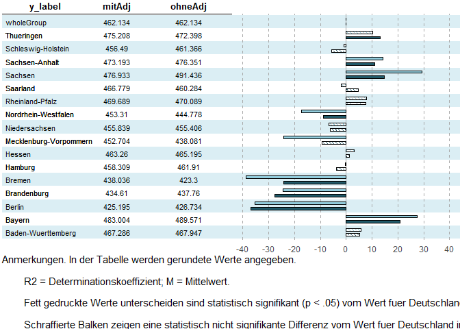
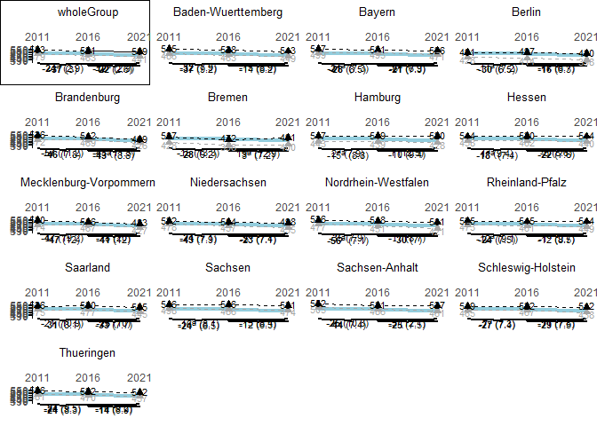

<!-- README.md is generated from README.Rmd. Please edit that file -->

# eatPlot

<!-- badges: start -->

[](https://github.com/nickhaf/eatPlot/actions/workflows/R-CMD-check.yaml)
[](https://app.codecov.io/gh/nickhaf/eatPlot?branch=main)
<!-- badges: end -->

The goal of eatPlot is to easily plot results stemming from the eatRep
package.

## Installation

You can install the development version of eatPlot from
[GitHub](https://github.com/) with:

``` r
# install.packages("devtools")
devtools::install_github("nickhaf/eatPlot")
```

## Basic workflow

### Data preperation

`eatPlot` makes it simple to prepare `eatRep` output for plotting.
Depending on whether you want to plot cross-sectional data or trenddata,
you can use either:

``` r
library(eatPlot)
barplot_data <- prep_no_trend(
  dat = adjusted_means,
  grouping_var = "adjust",
  columns = "adjust",
  competence = "GL",
  sig_niveau = 0.05
)
```

or:

``` r
lineplot_data <- prep_trend(dat = trend_books, 
                            grouping_var = "KBuecher_imp3", 
                            competence = "GL", 
                            sig_niveau = 0.05)
```

### Plotting

The prepared data can then fed into one of the plotting functions. For
example, if you want to plot a barplot with an ajacent table, first plot
both plots indidually, and then merge them together:

``` r
p_table <- plot_table(barplot_data[["plot_table"]])
p_bar <- plot_bar(barplot_data)


plot_table_bar(p_table, p_bar)
```



Or, if you want a lineplot:

``` r
plot_lineplot(lineplot_data)
```



    #> TableGrob (5 x 4) "arrange": 17 grobs
    #>                               z     cells    name           grob
    #> grobs.wholeGroup              1 (1-1,1-1) arrange gtable[layout]
    #> grobs.Baden-Wuerttemberg      2 (1-1,2-2) arrange gtable[layout]
    #> grobs.Bayern                  3 (1-1,3-3) arrange gtable[layout]
    #> grobs.Berlin                  4 (1-1,4-4) arrange gtable[layout]
    #> grobs.Brandenburg             5 (2-2,1-1) arrange gtable[layout]
    #> grobs.Bremen                  6 (2-2,2-2) arrange gtable[layout]
    #> grobs.Hamburg                 7 (2-2,3-3) arrange gtable[layout]
    #> grobs.Hessen                  8 (2-2,4-4) arrange gtable[layout]
    #> grobs.Mecklenburg-Vorpommern  9 (3-3,1-1) arrange gtable[layout]
    #> grobs.Niedersachsen          10 (3-3,2-2) arrange gtable[layout]
    #> grobs.Nordrhein-Westfalen    11 (3-3,3-3) arrange gtable[layout]
    #> grobs.Rheinland-Pfalz        12 (3-3,4-4) arrange gtable[layout]
    #> grobs.Saarland               13 (4-4,1-1) arrange gtable[layout]
    #> grobs.Sachsen                14 (4-4,2-2) arrange gtable[layout]
    #> grobs.Sachsen-Anhalt         15 (4-4,3-3) arrange gtable[layout]
    #> grobs.Schleswig-Holstein     16 (4-4,4-4) arrange gtable[layout]
    #> grobs.Thueringen             17 (5-5,1-1) arrange gtable[layout]
