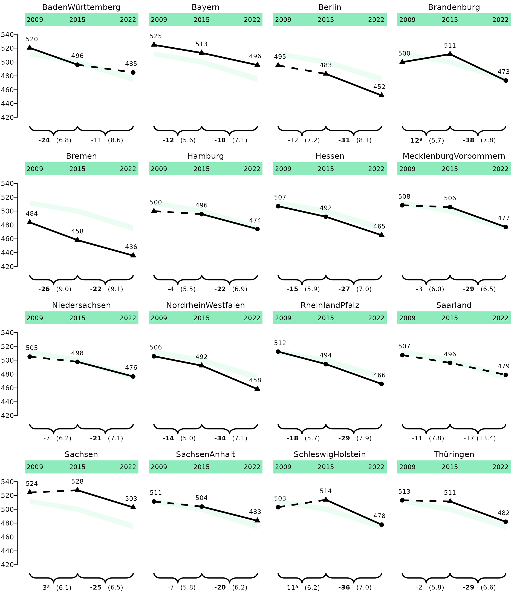
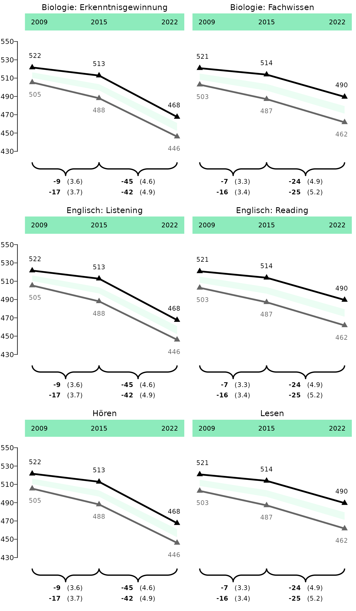
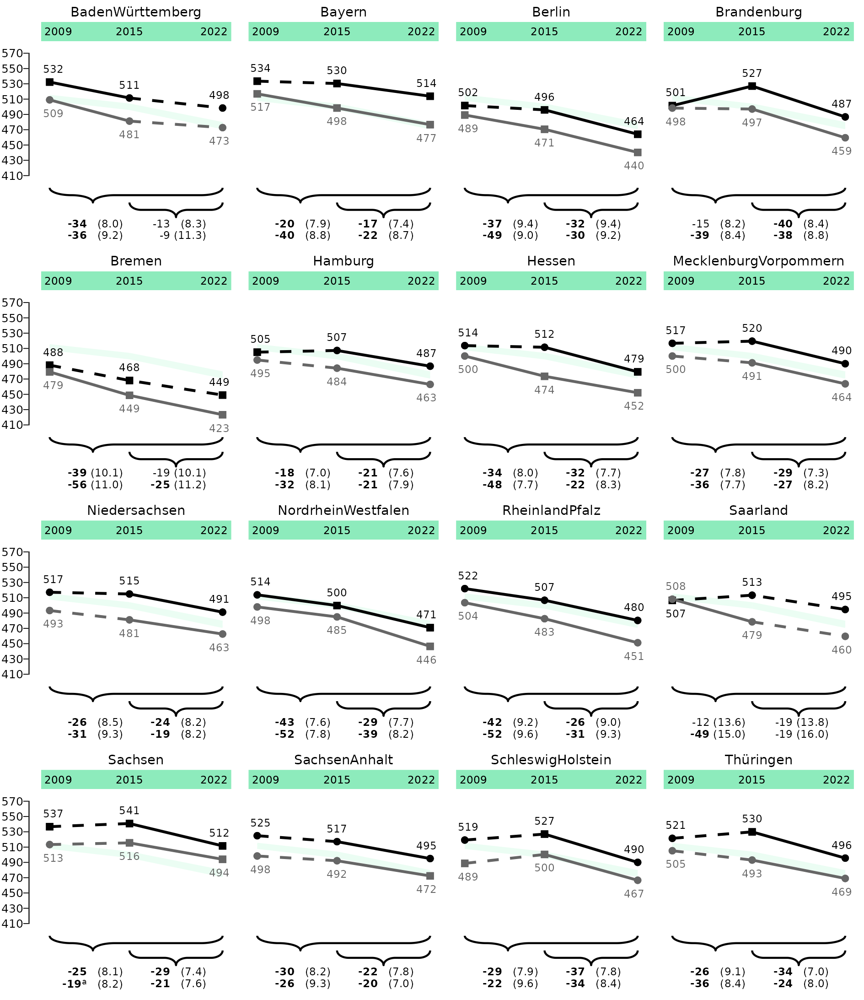

# Lineplots

This vignette shows you how to plot lineplots from `eatRep` data. The
workflow is optimized for Bildungstrend-graphs, but can be expanded for
plotting other `eatRep` data as well.

``` r
library(eatPlot)
```

## Lineplot for one group

Let’s take example data from the `trend_gender` example dataset. The
first step in the workflow always is the data preparation. This is
needed to bring the `eatRep` data into the correct format for plotting.

``` r
dat_lineplot_1 <- prep_lineplot(
  trend_gender[[1]],
  subgroup_var = "Kgender" ## Leave this argument if you have only one subgroup
)
```

It might be necessary to do some slight manual data preparation:

``` r
## Don't do that if you only have one group in your data, or want to plot all groups
dat_lineplot_1 <- subset(dat_lineplot_1, subgroup_var == "total")

## For correctly displaying the state names:
dat_lineplot_1$state_var <- process_bundesland(dat_lineplot_1$state_var)

dat_lineplot_1$subgroup_var <- as.factor(dat_lineplot_1$subgroup_var)
```

And then we can already plot:

``` r
lineplot_1 <- plot_lineplot(dat_lineplot_1,
  years_lines = list(c(2009, 2015), c(2015, 2022)),
  years_braces = list(c(2009, 2015), c(2015, 2022)),
  background_facet = "Deutschland",
  plot_settings = plotsettings_lineplot(
    axis_y_lims = c(420, 540),
    point_shapes = c("TRUE" = 17, "FALSE" = 16), ## Here we use the triangles 
    default_list = lineplot_4x4
  )
) 
```

``` r
save_plot(lineplot_1, filename = "C:/Users/hafiznij/Downloads/lineplot_1_group.pdf", width = 160, height = 185)
```



## Lineplot for two groups

``` r
dat_lineplot_2 <- prep_lineplot(
  trend_gender[[1]],
  subgroup_var = "Kgender"
)

dat_lineplot_2$state_var <- process_bundesland(dat_lineplot_2$state_var)


## We can set the order of the brace labels by setting the factor levels of the subgroup_var:
dat_lineplot_2$subgroup_var <- factor(dat_lineplot_2$subgroup_var, levels = c("female", "male", "total"), ordered = TRUE)

lineplot_2 <- plot_lineplot(
  dat_lineplot_2,
  years_lines = list(c(2009, 2015), c(2015, 2022)),
  years_braces = list(c(2009, 2015), c(2015, 2022)),
  background_facet = "Deutschland",
  background_subgroup = "total",
  plot_settings = plotsettings_lineplot(
    subgroup_colours = c(female = "black", male = cmyk(0, 0, 0, 60)), ## Here we determine the colours of the subgroups
    axis_y_lims = c(410, 560),
    default_list = lineplot_4x4
  )
)
```

``` r
save_plot(lineplot_2, filename = "C:/Users/hafiznij/Downloads/lineplot_2_groups.pdf", width = 160, height = 185)
```

``` r
lineplot_2
```


## Lineplot for whole Germany 3x2

``` r
trend_ger <- do.call(rbind, lapply(trend_gender, prep_lineplot, subgroup_var = "Kgender"))
trend_ger <- subset(trend_ger, state_var == "total")
trend_ger$subgroup_var <- factor(trend_ger$subgroup_var, levels = c("female", "male", "total"), ordered = TRUE)
trend_ger$kb <- gsub("hoeren", "Hören", trend_ger$kb)
trend_ger$kb <- gsub("lesen", "Lesen", trend_ger$kb)

trend_ger_2 <- trend_ger
trend_ger_3 <- trend_ger

trend_ger_2$kb <- gsub("Lesen", "Englisch: Reading", trend_ger_2$kb)
trend_ger_2$kb <- gsub("Hören", "Englisch: Listening", trend_ger_2$kb)


trend_ger_3$kb <- gsub("Lesen", "Biologie: Fachwissen", trend_ger_3$kb)
trend_ger_3$kb <- gsub("Hören", "Biologie: Erkenntnisgewinnung", trend_ger_3$kb)


trend_total <- rbind(trend_ger, trend_ger_2, trend_ger_3)
```

Her we have to add other significance columns for `point_sig` and
`brace_label_sig_superscript`!

``` r
lineplot_germany_1 <- plot_lineplot(
  trend_total,
  years_lines = list(c(2009, 2015), c(2015, 2022)),
  years_braces = list(c(2009, 2015), c(2015, 2022)),
  point_sig = "sig_mean_comp_crossDiff_sameFacet_totalSubgroup",
  brace_label_sig_superscript = "sig_mean_comp_trend_crossDiff_sameFacet_totalSubgroup", 
  facet_var = "kb",
  background_subgroup = "total",
  plot_settings = plotsettings_lineplot(
    subgroup_colours = c(female = "black", male = cmyk(0, 0, 0, 60)), ## Here we determine the colours of the subgroups
    brace_label_nudge_x = 0.22,
    n_cols = 2,
    axis_y_lims = c(430, 550),
    default_list = lineplot_germany
  )
)
```

``` r
save_plot(lineplot_germany_1, filename = "C:/Users/hafiznij/Downloads/lineplot_2_groups_germany_3x2.pdf", height = 185, width = 108)
```

``` r
lineplot_germany_1
```



## Lineplot for whole Germany 2x3

``` r
lineplot_germany_2 <- plot_lineplot(
  trend_total,
  years_lines = list(c(2009, 2015), c(2015, 2022)),
  years_braces = list(c(2009, 2015), c(2015, 2022)),
  facet_var = "kb",
  background_subgroup = "total",
  point_sig = "sig_mean_comp_crossDiff_sameFacet_totalSubgroup",
  brace_label_sig_superscript = "sig_mean_comp_trend_crossDiff_sameFacet_totalSubgroup", 
  plot_settings = plotsettings_lineplot(
    subgroup_colours = c(female = "black", male = cmyk(0, 0, 0, 60)), ## Here we determine the colours of the subgroups
    brace_label_nudge_x = 0.23,
    n_cols = 3,
    axis_y_lims = c(430, 550),
        default_list = lineplot_germany  )
)
```

``` r
save_plot(lineplot_germany_2, filename = "C:/Users/hafiznij/Downloads/lineplot_2_groups_germany2x3.pdf", height = 185 * 2 / 3, width = 160)
```

``` r
lineplot_germany_2
```


## Lineplot with missing values

``` r
dat_lineplot_2 <- prep_lineplot(
  trend_gender[[1]],
  subgroup_var = "Kgender"
)
```

``` r
## Einfügen von NAs zur Demonstration

dat_lineplot_2$est_mean_comp_none <- ifelse(dat_lineplot_2$state_var == "Berlin" & dat_lineplot_2$year == 2015, NA, dat_lineplot_2$est_mean_comp_none)
dat_lineplot_2$est_mean_comp_none <- ifelse(dat_lineplot_2$state_var == "Brandenburg" & dat_lineplot_2$year == 2009 & dat_lineplot_2$subgroup_var == "female", NA, dat_lineplot_2$est_mean_comp_none)

dat_lineplot_2$est_mean_comp_trend_sameFacet_sameSubgroup <- ifelse(dat_lineplot_2$state_var == "Brandenburg" & dat_lineplot_2$trend == "2009_2015" & dat_lineplot_2$subgroup_var == "female", NA, dat_lineplot_2$est_mean_comp_trend_sameFacet_sameSubgroup)

dat_lineplot_2$se_mean_comp_trend_sameFacet_sameSubgroup <- ifelse(dat_lineplot_2$state_var == "Brandenburg" & dat_lineplot_2$trend == "2009_2015" & dat_lineplot_2$subgroup_var == "female", NA, dat_lineplot_2$se_mean_comp_trend_sameFacet_sameSubgroup)

dat_lineplot_2 <- dat_lineplot_2[dat_lineplot_2$state_var != "Niedersachsen", ]
```

``` r
dat_lineplot_2$state_var <- process_bundesland(dat_lineplot_2$state_var)

## Relevel, so Deutschland comes at the end
dat_lineplot_2$state_var <- forcats::fct_relevel(dat_lineplot_2$state_var, "Deutschland", after = Inf)

## We can set the order of the brace labels by setting the factor levels of the subgroup_var:
dat_lineplot_2$subgroup_var <- factor(dat_lineplot_2$subgroup_var, levels = c("female", "male", "total"), ordered = TRUE)

state_levels <- levels(dat_lineplot_2$state_var)

years_lines_list <- stats::setNames(lapply(state_levels, function(x) list(c(2009, 2015), c(2015, 2022))), state_levels)

years_lines_list$`Baden-Württemberg`[[1]] <- NULL
years_lines_list$`Berlin` <- list()
```

One special feature of these plot is the depcition of two significance
types: Comparison against subgroup in the whole population for
Länder-facets, and comparison against total subgroup for the
Germany-facet. Therefore, we have to combine the two respective columns,
and give the values different names:

``` r
## Add NAs at the respective rows, so we can combine them afterwards:

dat_lineplot_2$sig_mean_comp_crossDiff_totalFacet_sameSubgroup_2 <- ifelse(dat_lineplot_2$state_var == "Deutschland", NA, dat_lineplot_2$sig_mean_comp_crossDiff_totalFacet_sameSubgroup)
dat_lineplot_2$sig_mean_comp_crossDiff_sameFacet_totalSubgroup_2 <- ifelse(dat_lineplot_2$state_var == "Deutschland", dat_lineplot_2$sig_mean_comp_crossDiff_sameFacet_totalSubgroup, NA)

## Add distinct values
dat_lineplot_2$sig_mean_comp_crossDiff_totalFacet_sameSubgroup_2 <- ifelse(!dat_lineplot_2$sig_mean_comp_crossDiff_totalFacet_sameSubgroup_2, "FALSE", paste(dat_lineplot_2$sig_mean_comp_crossDiff_totalFacet_sameSubgroup_2, "subgroup", sep = "_"))
dat_lineplot_2$sig_mean_comp_crossDiff_sameFacet_totalSubgroup_2 <- ifelse(!dat_lineplot_2$sig_mean_comp_crossDiff_sameFacet_totalSubgroup_2, "FALSE", paste(dat_lineplot_2$sig_mean_comp_crossDiff_sameFacet_totalSubgroup_2, "total", sep = "_"))

dat_lineplot_2$point_sig <- dplyr::coalesce(dat_lineplot_2$sig_mean_comp_crossDiff_totalFacet_sameSubgroup_2, dat_lineplot_2$sig_mean_comp_crossDiff_sameFacet_totalSubgroup_2)
```

Same for the trends. In this case, everything in Deutschland is not
significant, so we can leave it at that, but the workflow would be the
same:

``` r
dat_lineplot_2$sig_mean_comp_trend_crossDiff_sameFacet_totalSubgroup
```

    ##   [1] FALSE FALSE FALSE FALSE FALSE FALSE FALSE FALSE FALSE FALSE FALSE FALSE
    ##  [13] FALSE FALSE FALSE FALSE FALSE FALSE FALSE FALSE FALSE FALSE FALSE FALSE
    ##  [25] FALSE FALSE FALSE FALSE FALSE FALSE FALSE FALSE FALSE FALSE FALSE FALSE
    ##  [37] FALSE FALSE FALSE FALSE FALSE FALSE FALSE FALSE FALSE FALSE FALSE FALSE
    ##  [49] FALSE FALSE FALSE FALSE FALSE FALSE FALSE FALSE FALSE FALSE FALSE FALSE
    ##  [61] FALSE FALSE FALSE FALSE FALSE FALSE FALSE FALSE FALSE FALSE FALSE FALSE
    ##  [73] FALSE FALSE FALSE FALSE FALSE FALSE FALSE FALSE FALSE FALSE FALSE FALSE
    ##  [85] FALSE FALSE FALSE FALSE FALSE FALSE FALSE FALSE FALSE FALSE FALSE FALSE
    ##  [97] FALSE FALSE FALSE FALSE FALSE FALSE FALSE FALSE FALSE FALSE FALSE FALSE
    ## [109] FALSE FALSE FALSE FALSE FALSE FALSE FALSE FALSE FALSE FALSE FALSE FALSE
    ## [121] FALSE FALSE FALSE FALSE FALSE FALSE FALSE FALSE FALSE FALSE FALSE FALSE
    ## [133] FALSE FALSE FALSE FALSE FALSE FALSE FALSE FALSE FALSE FALSE FALSE FALSE
    ## [145] FALSE FALSE FALSE FALSE FALSE FALSE FALSE FALSE FALSE FALSE FALSE FALSE
    ## [157] FALSE FALSE FALSE FALSE FALSE FALSE FALSE FALSE FALSE FALSE FALSE FALSE
    ## [169] FALSE FALSE FALSE FALSE FALSE FALSE FALSE FALSE FALSE FALSE FALSE FALSE
    ## [181] FALSE FALSE FALSE FALSE FALSE FALSE FALSE FALSE FALSE FALSE FALSE FALSE
    ## [193] FALSE FALSE FALSE FALSE FALSE FALSE FALSE FALSE FALSE FALSE FALSE FALSE
    ## [205] FALSE FALSE FALSE FALSE FALSE FALSE FALSE FALSE FALSE FALSE FALSE FALSE
    ## [217] FALSE FALSE FALSE FALSE FALSE FALSE FALSE FALSE FALSE FALSE FALSE FALSE
    ## [229] FALSE FALSE FALSE FALSE FALSE FALSE FALSE FALSE FALSE FALSE FALSE FALSE
    ## [241] FALSE FALSE FALSE FALSE FALSE FALSE FALSE FALSE FALSE FALSE FALSE FALSE
    ## [253] FALSE FALSE FALSE FALSE FALSE FALSE FALSE FALSE FALSE FALSE FALSE FALSE
    ## [265] FALSE FALSE FALSE FALSE FALSE FALSE FALSE FALSE FALSE FALSE FALSE FALSE
    ## [277] FALSE FALSE FALSE FALSE FALSE FALSE FALSE FALSE FALSE FALSE FALSE FALSE

``` r
lineplot_na <- plot_lineplot(
  dat_lineplot_2,
  point_sig = point_sig, 
  years_lines = years_lines_list,
  years_braces = years_lines_list,
  background_facet = "Deutschland",
  background_subgroup = "total",
  box_facet = "Deutschland",
  plot_settings = plotsettings_lineplot(
    subgroup_colours = c(female = "black", male = cmyk(0, 0, 0, 60)), ## Here we determine the colours of the subgroups
    axis_y_lims = c(410, 560),
    background_facet_remove = FALSE,
    point_shapes = c("TRUE_subgroup" = 15, "TRUE_total" = 17, "FALSE" = 16), 
    default_list = lineplot_4x4
  )
)

## Because Deuschland is also our background-facet, the years we removed there are also not plotted in the background. 
```

``` r
save_plot(lineplot_na, filename = "C:/Users/hafiznij/Downloads/lineplot_na.pdf", width = 160, height = 185)
```

``` r
lineplot_na
```

    ## Warning: No shared levels found between `names(values)` of the manual scale and the
    ## data's linetype values.

    ## Warning: Removed 4 rows containing missing values or values outside the scale range
    ## (`geom_point()`).

    ## Warning: Removed 1 row containing missing values or values outside the scale range
    ## (`geom_text()`).

    ## Warning: Removed 1 row containing missing values or values outside the scale range
    ## (`geom_line()`).

    ## Warning: Removed 2 rows containing missing values or values outside the scale range
    ## (`geom_point()`).

    ## Warning: Removed 2 rows containing missing values or values outside the scale range
    ## (`geom_text()`).


## Lineplot with long trend

This is only needed for the supplement!

``` r
dat_lineplot_2 <- prep_lineplot(
  trend_gender[[1]],
  subgroup_var = "Kgender"
)

dat_lineplot_2$state_var <- process_bundesland(dat_lineplot_2$state_var)


## We can set the order of the brace labels by setting the factor levels of the subgroup_var:
dat_lineplot_2$subgroup_var <- factor(dat_lineplot_2$subgroup_var, levels = c("female", "male", "total"), ordered = TRUE)

lineplot_2_long <- plot_lineplot(
  dat_lineplot_2,
  years_lines = list(c(2009, 2015), c(2015, 2022)),
  years_braces = list(c(2009, 2022), c(2015, 2022)),
  background_facet = "Deutschland",
  background_subgroup = "total",
  plot_settings = plotsettings_lineplot(
    subgroup_colours = c(female = "black", male = cmyk(0, 0, 0, 60)), ## Here we determine the colours of the subgroups
    axis_y_lims = c(410, 560),
    brace_label_nudge_x = 0.175, 
    default_list = lineplot_4x4
  )
)
```

``` r
save_plot(lineplot_2_long, filename = "C:/Users/hafiznij/Downloads/lineplot_2_groups_long.pdf", width = 160, height = 185)
```

``` r
lineplot_2_long
```


