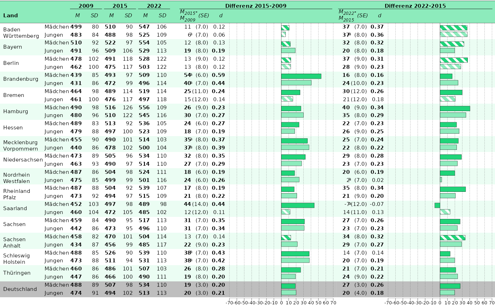

# Mehrere Kompetenzbereiche: Schleifen

``` r
library(eatPlot)
```

## Data preperation

The data we are using in this example is nexted into multiple competence
areas. Let’s take a look:

``` r
str(dispar)
#> List of 5
#>  $ hoeren:List of 4
#>   ..$ plain      :'data.frame':  2331 obs. of  17 variables:
#>   .. ..$ label1       : chr [1:2331] "trend (2015 - 2009) for BadenWuerttemberg_maennlich" "trend (2015 - 2009) for crossDiff (BadenWuerttemberg_maennlich - BadenWuerttemberg_total) " "trend (2015 - 2009) of groupDiff (maennlich - weiblich) in TR_BUNDESLAND=BadenWuerttemberg" "trend (2015 - 2009) for BadenWuerttemberg_total" ...
#>   .. ..$ label2       : chr [1:2331] "year=2015 - year=2009: TR_BUNDESLAND=BadenWuerttemberg, Kgender=maennlich" "[year=2015: (TR_BUNDESLAND=BadenWuerttemberg, Kgender=maennlich)] - [year=2009: (TR_BUNDESLAND=BadenWuerttember"| __truncated__ "[year=2015: (TR_BUNDESLAND=BadenWuerttemberg, Kgender=maennlich) - (TR_BUNDESLAND=BadenWuerttemberg, Kgender=we"| __truncated__ "year=2015 - year=2009: TR_BUNDESLAND=BadenWuerttemberg, Kgender=total" ...
#>   .. ..$ unit_1       : chr [1:2331] "group_31" "comp_757" "comp_154" "group_202" ...
#>   .. ..$ unit_2       : chr [1:2331] "group_225" "comp_1373" "comp_307" "group_339" ...
#>   .. ..$ depVar       : chr [1:2331] "bista" "bista" "bista" "bista" ...
#>   .. ..$ modus        : chr [1:2331] "JK2.mean__BIFIEsurvey" "JK2.mean__BIFIEsurvey" "JK2.mean__BIFIEsurvey" "JK2.mean__BIFIEsurvey" ...
#>   .. ..$ parameter    : chr [1:2331] "mean" "mean" "mean" "mean" ...
#>   .. ..$ comparison   : chr [1:2331] "trend" "trend_crossDiff" "trend_groupDiff" "trend" ...
#>   .. ..$ TR_BUNDESLAND: chr [1:2331] "BadenWuerttemberg" "BadenWuerttemberg" "BadenWuerttemberg" "BadenWuerttemberg" ...
#>   .. ..$ Kgender      : chr [1:2331] "maennlich" "maennlich - total" "maennlich - weiblich" "total" ...
#>   .. ..$ year         : chr [1:2331] "2015 - 2009" "2015 - 2009" "2015 - 2009" "2015 - 2009" ...
#>   .. ..$ id           : chr [1:2331] "comp_32" "comp_758" "comp_155" "comp_203" ...
#>   .. ..$ kb           : chr [1:2331] "hoeren" "hoeren" "hoeren" "hoeren" ...
#>   .. ..$ est          : num [1:2331] -40.74 -6.47 12.97 -34.27 -27.77 ...
#>   .. ..$ se           : num [1:2331] 7.66 9.42 8.18 6.15 6.71 ...
#>   .. ..$ p            : num [1:2331] 0 0.492 0.113 0 0 0.453 0.004 0 0.605 0.001 ...
#>   .. ..$ es           : num [1:2331] -0.395 NA NA -0.336 -0.282 NA NA NA NA NA ...
#>   ..$ comparisons:'data.frame':  1719 obs. of  4 variables:
#>   .. ..$ id        : chr [1:1719] "comp_32" "comp_758" "comp_155" "comp_203" ...
#>   .. ..$ unit_1    : chr [1:1719] "group_31" "comp_757" "comp_154" "group_202" ...
#>   .. ..$ unit_2    : chr [1:1719] "group_225" "comp_1373" "comp_307" "group_339" ...
#>   .. ..$ comparison: chr [1:1719] "trend" "trend_crossDiff" "trend_groupDiff" "trend" ...
#>   ..$ group      :'data.frame':  153 obs. of  5 variables:
#>   .. ..$ id           : chr [1:153] "group_31" "group_202" "group_85" "group_34" ...
#>   .. ..$ TR_BUNDESLAND: chr [1:153] "BadenWuerttemberg" "BadenWuerttemberg" "BadenWuerttemberg" "Bayern" ...
#>   .. ..$ Kgender      : chr [1:153] "maennlich" "total" "weiblich" "maennlich" ...
#>   .. ..$ year         : chr [1:153] "2009" "2009" "2009" "2009" ...
#>   .. ..$ kb           : chr [1:153] "hoeren" "hoeren" "hoeren" "hoeren" ...
#>   ..$ estimate   :'data.frame':  2331 obs. of  7 variables:
#>   .. ..$ id       : chr [1:2331] "comp_32" "comp_758" "comp_155" "comp_203" ...
#>   .. ..$ depVar   : chr [1:2331] "bista" "bista" "bista" "bista" ...
#>   .. ..$ parameter: chr [1:2331] "mean" "mean" "mean" "mean" ...
#>   .. ..$ est      : num [1:2331] -40.74 -6.47 12.97 -34.27 -27.77 ...
#>   .. ..$ se       : num [1:2331] 7.66 9.42 8.18 6.15 6.71 ...
#>   .. ..$ p        : num [1:2331] 0 0.492 0.113 0 0 0.453 0.004 0 0.605 0.001 ...
#>   .. ..$ es       : num [1:2331] -0.395 NA NA -0.336 -0.282 NA NA NA NA NA ...
#>   ..- attr(*, "class")= chr [1:2] "list" "report2"
#>  $ lesen :List of 4
#>   ..$ plain      :'data.frame':  2331 obs. of  17 variables:
#>   .. ..$ label1       : chr [1:2331] "trend (2015 - 2009) for BadenWuerttemberg_maennlich" "trend (2015 - 2009) for crossDiff (BadenWuerttemberg_maennlich - BadenWuerttemberg_total) " "trend (2015 - 2009) of groupDiff (maennlich - weiblich) in TR_BUNDESLAND=BadenWuerttemberg" "trend (2015 - 2009) for BadenWuerttemberg_total" ...
#>   .. ..$ label2       : chr [1:2331] "year=2015 - year=2009: TR_BUNDESLAND=BadenWuerttemberg, Kgender=maennlich" "[year=2015: (TR_BUNDESLAND=BadenWuerttemberg, Kgender=maennlich)] - [year=2009: (TR_BUNDESLAND=BadenWuerttember"| __truncated__ "[year=2015: (TR_BUNDESLAND=BadenWuerttemberg, Kgender=maennlich) - (TR_BUNDESLAND=BadenWuerttemberg, Kgender=we"| __truncated__ "year=2015 - year=2009: TR_BUNDESLAND=BadenWuerttemberg, Kgender=total" ...
#>   .. ..$ unit_1       : chr [1:2331] "group_31" "comp_757" "comp_154" "group_202" ...
#>   .. ..$ unit_2       : chr [1:2331] "group_225" "comp_1373" "comp_307" "group_339" ...
#>   .. ..$ depVar       : chr [1:2331] "bista" "bista" "bista" "bista" ...
#>   .. ..$ modus        : chr [1:2331] "JK2.mean__BIFIEsurvey" "JK2.mean__BIFIEsurvey" "JK2.mean__BIFIEsurvey" "JK2.mean__BIFIEsurvey" ...
#>   .. ..$ parameter    : chr [1:2331] "mean" "mean" "mean" "mean" ...
#>   .. ..$ comparison   : chr [1:2331] "trend" "trend_crossDiff" "trend_groupDiff" "trend" ...
#>   .. ..$ TR_BUNDESLAND: chr [1:2331] "BadenWuerttemberg" "BadenWuerttemberg" "BadenWuerttemberg" "BadenWuerttemberg" ...
#>   .. ..$ Kgender      : chr [1:2331] "maennlich" "maennlich - total" "maennlich - weiblich" "total" ...
#>   .. ..$ year         : chr [1:2331] "2015 - 2009" "2015 - 2009" "2015 - 2009" "2015 - 2009" ...
#>   .. ..$ id           : chr [1:2331] "comp_32" "comp_758" "comp_155" "comp_203" ...
#>   .. ..$ kb           : chr [1:2331] "lesen" "lesen" "lesen" "lesen" ...
#>   .. ..$ est          : num [1:2331] -27.76 -3.48 6.9 -24.28 -20.86 ...
#>   .. ..$ se           : num [1:2331] 8.9 10.97 7.93 6.81 6.51 ...
#>   .. ..$ p            : num [1:2331] 0.002 0.751 0.385 0 0.001 0.709 0.196 0.077 0.824 0.074 ...
#>   .. ..$ es           : num [1:2331] -0.271 NA NA -0.246 -0.226 NA NA NA NA NA ...
#>   ..$ comparisons:'data.frame':  1719 obs. of  4 variables:
#>   .. ..$ id        : chr [1:1719] "comp_32" "comp_758" "comp_155" "comp_203" ...
#>   .. ..$ unit_1    : chr [1:1719] "group_31" "comp_757" "comp_154" "group_202" ...
#>   .. ..$ unit_2    : chr [1:1719] "group_225" "comp_1373" "comp_307" "group_339" ...
#>   .. ..$ comparison: chr [1:1719] "trend" "trend_crossDiff" "trend_groupDiff" "trend" ...
#>   ..$ group      :'data.frame':  153 obs. of  5 variables:
#>   .. ..$ id           : chr [1:153] "group_31" "group_202" "group_85" "group_34" ...
#>   .. ..$ TR_BUNDESLAND: chr [1:153] "BadenWuerttemberg" "BadenWuerttemberg" "BadenWuerttemberg" "Bayern" ...
#>   .. ..$ Kgender      : chr [1:153] "maennlich" "total" "weiblich" "maennlich" ...
#>   .. ..$ year         : chr [1:153] "2009" "2009" "2009" "2009" ...
#>   .. ..$ kb           : chr [1:153] "lesen" "lesen" "lesen" "lesen" ...
#>   ..$ estimate   :'data.frame':  2331 obs. of  7 variables:
#>   .. ..$ id       : chr [1:2331] "comp_32" "comp_758" "comp_155" "comp_203" ...
#>   .. ..$ depVar   : chr [1:2331] "bista" "bista" "bista" "bista" ...
#>   .. ..$ parameter: chr [1:2331] "mean" "mean" "mean" "mean" ...
#>   .. ..$ est      : num [1:2331] -27.76 -3.48 6.9 -24.28 -20.86 ...
#>   .. ..$ se       : num [1:2331] 8.9 10.97 7.93 6.81 6.51 ...
#>   .. ..$ p        : num [1:2331] 0.002 0.751 0.385 0 0.001 0.709 0.196 0.077 0.824 0.074 ...
#>   .. ..$ es       : num [1:2331] -0.271 NA NA -0.246 -0.226 NA NA NA NA NA ...
#>   ..- attr(*, "class")= chr [1:2] "list" "report2"
#>  $ listen:List of 4
#>   ..$ plain      :'data.frame':  2331 obs. of  17 variables:
#>   .. ..$ label1       : chr [1:2331] "trend (2015 - 2009) for BadenWuerttemberg_maennlich" "trend (2015 - 2009) for crossDiff (BadenWuerttemberg_maennlich - BadenWuerttemberg_total) " "trend (2015 - 2009) of groupDiff (maennlich - weiblich) in TR_BUNDESLAND=BadenWuerttemberg" "trend (2015 - 2009) for BadenWuerttemberg_total" ...
#>   .. ..$ label2       : chr [1:2331] "year=2015 - year=2009: TR_BUNDESLAND=BadenWuerttemberg, Kgender=maennlich" "[year=2015: (TR_BUNDESLAND=BadenWuerttemberg, Kgender=maennlich)] - [year=2009: (TR_BUNDESLAND=BadenWuerttember"| __truncated__ "[year=2015: (TR_BUNDESLAND=BadenWuerttemberg, Kgender=maennlich) - (TR_BUNDESLAND=BadenWuerttemberg, Kgender=we"| __truncated__ "year=2015 - year=2009: TR_BUNDESLAND=BadenWuerttemberg, Kgender=total" ...
#>   .. ..$ unit_1       : chr [1:2331] "group_31" "comp_757" "comp_154" "group_202" ...
#>   .. ..$ unit_2       : chr [1:2331] "group_225" "comp_1373" "comp_307" "group_339" ...
#>   .. ..$ depVar       : chr [1:2331] "bista" "bista" "bista" "bista" ...
#>   .. ..$ modus        : chr [1:2331] "JK2.mean__BIFIEsurvey" "JK2.mean__BIFIEsurvey" "JK2.mean__BIFIEsurvey" "JK2.mean__BIFIEsurvey" ...
#>   .. ..$ parameter    : chr [1:2331] "mean" "mean" "mean" "mean" ...
#>   .. ..$ comparison   : chr [1:2331] "trend" "trend_crossDiff" "trend_groupDiff" "trend" ...
#>   .. ..$ TR_BUNDESLAND: chr [1:2331] "BadenWuerttemberg" "BadenWuerttemberg" "BadenWuerttemberg" "BadenWuerttemberg" ...
#>   .. ..$ Kgender      : chr [1:2331] "maennlich" "maennlich - total" "maennlich - weiblich" "total" ...
#>   .. ..$ year         : chr [1:2331] "2015 - 2009" "2015 - 2009" "2015 - 2009" "2015 - 2009" ...
#>   .. ..$ id           : chr [1:2331] "comp_32" "comp_758" "comp_155" "comp_203" ...
#>   .. ..$ kb           : chr [1:2331] "listen" "listen" "listen" "listen" ...
#>   .. ..$ est          : num [1:2331] 5.73 -2.36 4.88 8.09 10.61 ...
#>   .. ..$ se           : num [1:2331] 6.64 8.62 6.91 5.82 6.67 ...
#>   .. ..$ p            : num [1:2331] 0.388 0.784 0.48 0.165 0.112 0.77 0.045 0.05 0.439 0.067 ...
#>   .. ..$ es           : num [1:2331] 0.063 NA NA 0.091 0.125 NA NA NA NA NA ...
#>   ..$ comparisons:'data.frame':  1719 obs. of  4 variables:
#>   .. ..$ id        : chr [1:1719] "comp_32" "comp_758" "comp_155" "comp_203" ...
#>   .. ..$ unit_1    : chr [1:1719] "group_31" "comp_757" "comp_154" "group_202" ...
#>   .. ..$ unit_2    : chr [1:1719] "group_225" "comp_1373" "comp_307" "group_339" ...
#>   .. ..$ comparison: chr [1:1719] "trend" "trend_crossDiff" "trend_groupDiff" "trend" ...
#>   ..$ group      :'data.frame':  153 obs. of  5 variables:
#>   .. ..$ id           : chr [1:153] "group_31" "group_202" "group_85" "group_34" ...
#>   .. ..$ TR_BUNDESLAND: chr [1:153] "BadenWuerttemberg" "BadenWuerttemberg" "BadenWuerttemberg" "Bayern" ...
#>   .. ..$ Kgender      : chr [1:153] "maennlich" "total" "weiblich" "maennlich" ...
#>   .. ..$ year         : chr [1:153] "2009" "2009" "2009" "2009" ...
#>   .. ..$ kb           : chr [1:153] "listen" "listen" "listen" "listen" ...
#>   ..$ estimate   :'data.frame':  2331 obs. of  7 variables:
#>   .. ..$ id       : chr [1:2331] "comp_32" "comp_758" "comp_155" "comp_203" ...
#>   .. ..$ depVar   : chr [1:2331] "bista" "bista" "bista" "bista" ...
#>   .. ..$ parameter: chr [1:2331] "mean" "mean" "mean" "mean" ...
#>   .. ..$ est      : num [1:2331] 5.73 -2.36 4.88 8.09 10.61 ...
#>   .. ..$ se       : num [1:2331] 6.64 8.62 6.91 5.82 6.67 ...
#>   .. ..$ p        : num [1:2331] 0.388 0.784 0.48 0.165 0.112 0.77 0.045 0.05 0.439 0.067 ...
#>   .. ..$ es       : num [1:2331] 0.063 NA NA 0.091 0.125 NA NA NA NA NA ...
#>   ..- attr(*, "class")= chr [1:2] "list" "report2"
#>  $ ortho :List of 4
#>   ..$ plain      :'data.frame':  2331 obs. of  17 variables:
#>   .. ..$ label1       : chr [1:2331] "trend (2015 - 2009) for BadenWuerttemberg_maennlich" "trend (2015 - 2009) for crossDiff (BadenWuerttemberg_maennlich - BadenWuerttemberg_total) " "trend (2015 - 2009) of groupDiff (maennlich - weiblich) in TR_BUNDESLAND=BadenWuerttemberg" "trend (2015 - 2009) for BadenWuerttemberg_total" ...
#>   .. ..$ label2       : chr [1:2331] "year=2015 - year=2009: TR_BUNDESLAND=BadenWuerttemberg, Kgender=maennlich" "[year=2015: (TR_BUNDESLAND=BadenWuerttemberg, Kgender=maennlich)] - [year=2009: (TR_BUNDESLAND=BadenWuerttember"| __truncated__ "[year=2015: (TR_BUNDESLAND=BadenWuerttemberg, Kgender=maennlich) - (TR_BUNDESLAND=BadenWuerttemberg, Kgender=we"| __truncated__ "year=2015 - year=2009: TR_BUNDESLAND=BadenWuerttemberg, Kgender=total" ...
#>   .. ..$ unit_1       : chr [1:2331] "group_31" "comp_757" "comp_154" "group_202" ...
#>   .. ..$ unit_2       : chr [1:2331] "group_225" "comp_1373" "comp_307" "group_339" ...
#>   .. ..$ depVar       : chr [1:2331] "bista" "bista" "bista" "bista" ...
#>   .. ..$ modus        : chr [1:2331] "JK2.mean__BIFIEsurvey" "JK2.mean__BIFIEsurvey" "JK2.mean__BIFIEsurvey" "JK2.mean__BIFIEsurvey" ...
#>   .. ..$ parameter    : chr [1:2331] "mean" "mean" "mean" "mean" ...
#>   .. ..$ comparison   : chr [1:2331] "trend" "trend_crossDiff" "trend_groupDiff" "trend" ...
#>   .. ..$ TR_BUNDESLAND: chr [1:2331] "BadenWuerttemberg" "BadenWuerttemberg" "BadenWuerttemberg" "BadenWuerttemberg" ...
#>   .. ..$ Kgender      : chr [1:2331] "maennlich" "maennlich - total" "maennlich - weiblich" "total" ...
#>   .. ..$ year         : chr [1:2331] "2015 - 2009" "2015 - 2009" "2015 - 2009" "2015 - 2009" ...
#>   .. ..$ id           : chr [1:2331] "comp_32" "comp_758" "comp_155" "comp_203" ...
#>   .. ..$ kb           : chr [1:2331] "ortho" "ortho" "ortho" "ortho" ...
#>   .. ..$ est          : num [1:2331] -18 -0.984 1.639 -17.016 -16.361 ...
#>   .. ..$ se           : num [1:2331] 6.92 8.64 7.93 5.47 6.21 ...
#>   .. ..$ p            : num [1:2331] 0.009 0.909 0.836 0.002 0.008 0.935 0.023 0.048 0.464 0.022 ...
#>   .. ..$ es           : num [1:2331] -0.177 NA NA -0.168 -0.174 NA NA NA NA NA ...
#>   ..$ comparisons:'data.frame':  1719 obs. of  4 variables:
#>   .. ..$ id        : chr [1:1719] "comp_32" "comp_758" "comp_155" "comp_203" ...
#>   .. ..$ unit_1    : chr [1:1719] "group_31" "comp_757" "comp_154" "group_202" ...
#>   .. ..$ unit_2    : chr [1:1719] "group_225" "comp_1373" "comp_307" "group_339" ...
#>   .. ..$ comparison: chr [1:1719] "trend" "trend_crossDiff" "trend_groupDiff" "trend" ...
#>   ..$ group      :'data.frame':  153 obs. of  5 variables:
#>   .. ..$ id           : chr [1:153] "group_31" "group_202" "group_85" "group_34" ...
#>   .. ..$ TR_BUNDESLAND: chr [1:153] "BadenWuerttemberg" "BadenWuerttemberg" "BadenWuerttemberg" "Bayern" ...
#>   .. ..$ Kgender      : chr [1:153] "maennlich" "total" "weiblich" "maennlich" ...
#>   .. ..$ year         : chr [1:153] "2009" "2009" "2009" "2009" ...
#>   .. ..$ kb           : chr [1:153] "ortho" "ortho" "ortho" "ortho" ...
#>   ..$ estimate   :'data.frame':  2331 obs. of  7 variables:
#>   .. ..$ id       : chr [1:2331] "comp_32" "comp_758" "comp_155" "comp_203" ...
#>   .. ..$ depVar   : chr [1:2331] "bista" "bista" "bista" "bista" ...
#>   .. ..$ parameter: chr [1:2331] "mean" "mean" "mean" "mean" ...
#>   .. ..$ est      : num [1:2331] -18 -0.984 1.639 -17.016 -16.361 ...
#>   .. ..$ se       : num [1:2331] 6.92 8.64 7.93 5.47 6.21 ...
#>   .. ..$ p        : num [1:2331] 0.009 0.909 0.836 0.002 0.008 0.935 0.023 0.048 0.464 0.022 ...
#>   .. ..$ es       : num [1:2331] -0.177 NA NA -0.168 -0.174 NA NA NA NA NA ...
#>   ..- attr(*, "class")= chr [1:2] "list" "report2"
#>  $ read  :List of 4
#>   ..$ plain      :'data.frame':  2331 obs. of  17 variables:
#>   .. ..$ label1       : chr [1:2331] "trend (2015 - 2009) for BadenWuerttemberg_maennlich" "trend (2015 - 2009) for crossDiff (BadenWuerttemberg_maennlich - BadenWuerttemberg_total) " "trend (2015 - 2009) of groupDiff (maennlich - weiblich) in TR_BUNDESLAND=BadenWuerttemberg" "trend (2015 - 2009) for BadenWuerttemberg_total" ...
#>   .. ..$ label2       : chr [1:2331] "year=2015 - year=2009: TR_BUNDESLAND=BadenWuerttemberg, Kgender=maennlich" "[year=2015: (TR_BUNDESLAND=BadenWuerttemberg, Kgender=maennlich)] - [year=2009: (TR_BUNDESLAND=BadenWuerttember"| __truncated__ "[year=2015: (TR_BUNDESLAND=BadenWuerttemberg, Kgender=maennlich) - (TR_BUNDESLAND=BadenWuerttemberg, Kgender=we"| __truncated__ "year=2015 - year=2009: TR_BUNDESLAND=BadenWuerttemberg, Kgender=total" ...
#>   .. ..$ unit_1       : chr [1:2331] "group_31" "comp_757" "comp_154" "group_202" ...
#>   .. ..$ unit_2       : chr [1:2331] "group_225" "comp_1373" "comp_307" "group_339" ...
#>   .. ..$ depVar       : chr [1:2331] "bista" "bista" "bista" "bista" ...
#>   .. ..$ modus        : chr [1:2331] "JK2.mean__BIFIEsurvey" "JK2.mean__BIFIEsurvey" "JK2.mean__BIFIEsurvey" "JK2.mean__BIFIEsurvey" ...
#>   .. ..$ parameter    : chr [1:2331] "mean" "mean" "mean" "mean" ...
#>   .. ..$ comparison   : chr [1:2331] "trend" "trend_crossDiff" "trend_groupDiff" "trend" ...
#>   .. ..$ TR_BUNDESLAND: chr [1:2331] "BadenWuerttemberg" "BadenWuerttemberg" "BadenWuerttemberg" "BadenWuerttemberg" ...
#>   .. ..$ Kgender      : chr [1:2331] "maennlich" "maennlich - total" "maennlich - weiblich" "total" ...
#>   .. ..$ year         : chr [1:2331] "2015 - 2009" "2015 - 2009" "2015 - 2009" "2015 - 2009" ...
#>   .. ..$ id           : chr [1:2331] "comp_32" "comp_758" "comp_155" "comp_203" ...
#>   .. ..$ kb           : chr [1:2331] "read" "read" "read" "read" ...
#>   .. ..$ est          : num [1:2331] -0.757 -8.125 16.415 7.368 15.658 ...
#>   .. ..$ se           : num [1:2331] 6.32 7.98 7.54 5.22 6.35 ...
#>   .. ..$ p            : num [1:2331] 0.905 0.309 0.03 0.158 0.014 0.301 0.047 0.017 0.154 0.176 ...
#>   .. ..$ es           : num [1:2331] -0.008 NA NA 0.085 0.19 NA NA NA NA NA ...
#>   ..$ comparisons:'data.frame':  1719 obs. of  4 variables:
#>   .. ..$ id        : chr [1:1719] "comp_32" "comp_758" "comp_155" "comp_203" ...
#>   .. ..$ unit_1    : chr [1:1719] "group_31" "comp_757" "comp_154" "group_202" ...
#>   .. ..$ unit_2    : chr [1:1719] "group_225" "comp_1373" "comp_307" "group_339" ...
#>   .. ..$ comparison: chr [1:1719] "trend" "trend_crossDiff" "trend_groupDiff" "trend" ...
#>   ..$ group      :'data.frame':  153 obs. of  5 variables:
#>   .. ..$ id           : chr [1:153] "group_31" "group_202" "group_85" "group_34" ...
#>   .. ..$ TR_BUNDESLAND: chr [1:153] "BadenWuerttemberg" "BadenWuerttemberg" "BadenWuerttemberg" "Bayern" ...
#>   .. ..$ Kgender      : chr [1:153] "maennlich" "total" "weiblich" "maennlich" ...
#>   .. ..$ year         : chr [1:153] "2009" "2009" "2009" "2009" ...
#>   .. ..$ kb           : chr [1:153] "read" "read" "read" "read" ...
#>   ..$ estimate   :'data.frame':  2331 obs. of  7 variables:
#>   .. ..$ id       : chr [1:2331] "comp_32" "comp_758" "comp_155" "comp_203" ...
#>   .. ..$ depVar   : chr [1:2331] "bista" "bista" "bista" "bista" ...
#>   .. ..$ parameter: chr [1:2331] "mean" "mean" "mean" "mean" ...
#>   .. ..$ est      : num [1:2331] -0.757 -8.125 16.415 7.368 15.658 ...
#>   .. ..$ se       : num [1:2331] 6.32 7.98 7.54 5.22 6.35 ...
#>   .. ..$ p        : num [1:2331] 0.905 0.309 0.03 0.158 0.014 0.301 0.047 0.017 0.154 0.176 ...
#>   .. ..$ es       : num [1:2331] -0.008 NA NA 0.085 0.19 NA NA NA NA NA ...
#>   ..- attr(*, "class")= chr [1:2] "list" "report2"
#>  - attr(*, "dim")= int 5
#>  - attr(*, "dimnames")=List of 1
#>   ..$ datK6.auswahl[, "kb"]: chr [1:5] "hoeren" "lesen" "listen" "ortho" ...
#>  - attr(*, "call")= language by.data.frame(data = datK6.auswahl, INDICES = datK6.auswahl[, "kb"], FUN = function(kb) {     disp <- repMean(dat| __truncated__ ...
#>  - attr(*, "class")= chr "by"
```

We have multiple competence areas:

``` r
names(dispar)
#> [1] "hoeren" "lesen"  "listen" "ortho"  "read"
```

To build plots for all competence areas, I’d suggest to follow these
three steps:

1.  Build one plot.
2.  Adjust it, until you are satisfied.
3.  Put it into a function.
4.  Use [`lapply()`](https://rdrr.io/r/base/lapply.html) to loop over
    the competence areas and build the plots from the function defined
    in step 2.

## 1. Build the plot

Our goal is to build [Abbildung
6.6](https://nickhaf.github.io/eatPlot/articles/tableplots.html#abbildung-6-6).
Let’s take `hoeren` for our prototype:

``` r
str(dispar$hoeren)
#> List of 4
#>  $ plain      :'data.frame': 2331 obs. of  17 variables:
#>   ..$ label1       : chr [1:2331] "trend (2015 - 2009) for BadenWuerttemberg_maennlich" "trend (2015 - 2009) for crossDiff (BadenWuerttemberg_maennlich - BadenWuerttemberg_total) " "trend (2015 - 2009) of groupDiff (maennlich - weiblich) in TR_BUNDESLAND=BadenWuerttemberg" "trend (2015 - 2009) for BadenWuerttemberg_total" ...
#>   ..$ label2       : chr [1:2331] "year=2015 - year=2009: TR_BUNDESLAND=BadenWuerttemberg, Kgender=maennlich" "[year=2015: (TR_BUNDESLAND=BadenWuerttemberg, Kgender=maennlich)] - [year=2009: (TR_BUNDESLAND=BadenWuerttember"| __truncated__ "[year=2015: (TR_BUNDESLAND=BadenWuerttemberg, Kgender=maennlich) - (TR_BUNDESLAND=BadenWuerttemberg, Kgender=we"| __truncated__ "year=2015 - year=2009: TR_BUNDESLAND=BadenWuerttemberg, Kgender=total" ...
#>   ..$ unit_1       : chr [1:2331] "group_31" "comp_757" "comp_154" "group_202" ...
#>   ..$ unit_2       : chr [1:2331] "group_225" "comp_1373" "comp_307" "group_339" ...
#>   ..$ depVar       : chr [1:2331] "bista" "bista" "bista" "bista" ...
#>   ..$ modus        : chr [1:2331] "JK2.mean__BIFIEsurvey" "JK2.mean__BIFIEsurvey" "JK2.mean__BIFIEsurvey" "JK2.mean__BIFIEsurvey" ...
#>   ..$ parameter    : chr [1:2331] "mean" "mean" "mean" "mean" ...
#>   ..$ comparison   : chr [1:2331] "trend" "trend_crossDiff" "trend_groupDiff" "trend" ...
#>   ..$ TR_BUNDESLAND: chr [1:2331] "BadenWuerttemberg" "BadenWuerttemberg" "BadenWuerttemberg" "BadenWuerttemberg" ...
#>   ..$ Kgender      : chr [1:2331] "maennlich" "maennlich - total" "maennlich - weiblich" "total" ...
#>   ..$ year         : chr [1:2331] "2015 - 2009" "2015 - 2009" "2015 - 2009" "2015 - 2009" ...
#>   ..$ id           : chr [1:2331] "comp_32" "comp_758" "comp_155" "comp_203" ...
#>   ..$ kb           : chr [1:2331] "hoeren" "hoeren" "hoeren" "hoeren" ...
#>   ..$ est          : num [1:2331] -40.74 -6.47 12.97 -34.27 -27.77 ...
#>   ..$ se           : num [1:2331] 7.66 9.42 8.18 6.15 6.71 ...
#>   ..$ p            : num [1:2331] 0 0.492 0.113 0 0 0.453 0.004 0 0.605 0.001 ...
#>   ..$ es           : num [1:2331] -0.395 NA NA -0.336 -0.282 NA NA NA NA NA ...
#>  $ comparisons:'data.frame': 1719 obs. of  4 variables:
#>   ..$ id        : chr [1:1719] "comp_32" "comp_758" "comp_155" "comp_203" ...
#>   ..$ unit_1    : chr [1:1719] "group_31" "comp_757" "comp_154" "group_202" ...
#>   ..$ unit_2    : chr [1:1719] "group_225" "comp_1373" "comp_307" "group_339" ...
#>   ..$ comparison: chr [1:1719] "trend" "trend_crossDiff" "trend_groupDiff" "trend" ...
#>  $ group      :'data.frame': 153 obs. of  5 variables:
#>   ..$ id           : chr [1:153] "group_31" "group_202" "group_85" "group_34" ...
#>   ..$ TR_BUNDESLAND: chr [1:153] "BadenWuerttemberg" "BadenWuerttemberg" "BadenWuerttemberg" "Bayern" ...
#>   ..$ Kgender      : chr [1:153] "maennlich" "total" "weiblich" "maennlich" ...
#>   ..$ year         : chr [1:153] "2009" "2009" "2009" "2009" ...
#>   ..$ kb           : chr [1:153] "hoeren" "hoeren" "hoeren" "hoeren" ...
#>  $ estimate   :'data.frame': 2331 obs. of  7 variables:
#>   ..$ id       : chr [1:2331] "comp_32" "comp_758" "comp_155" "comp_203" ...
#>   ..$ depVar   : chr [1:2331] "bista" "bista" "bista" "bista" ...
#>   ..$ parameter: chr [1:2331] "mean" "mean" "mean" "mean" ...
#>   ..$ est      : num [1:2331] -40.74 -6.47 12.97 -34.27 -27.77 ...
#>   ..$ se       : num [1:2331] 7.66 9.42 8.18 6.15 6.71 ...
#>   ..$ p        : num [1:2331] 0 0.492 0.113 0 0 0.453 0.004 0 0.605 0.001 ...
#>   ..$ es       : num [1:2331] -0.395 NA NA -0.336 -0.282 NA NA NA NA NA ...
#>  - attr(*, "class")= chr [1:2] "list" "report2"
```

First, I need to search for an appropriate template on this website.
Luckily, we already have a template for [Abbildung
6.6](https://nickhaf.github.io/eatPlot/articles/tableplots.html#abbildung-6-6).
So ewe only need to follow it!  
To do this, I first have to look up how my subgroup variable is called.
I can find this out easiest by looking at the `group` or the `plain`
data.frame:

``` r
str(dispar$hoeren$group)
#> 'data.frame':    153 obs. of  5 variables:
#>  $ id           : chr  "group_31" "group_202" "group_85" "group_34" ...
#>  $ TR_BUNDESLAND: chr  "BadenWuerttemberg" "BadenWuerttemberg" "BadenWuerttemberg" "Bayern" ...
#>  $ Kgender      : chr  "maennlich" "total" "weiblich" "maennlich" ...
#>  $ year         : chr  "2009" "2009" "2009" "2009" ...
#>  $ kb           : chr  "hoeren" "hoeren" "hoeren" "hoeren" ...
```

My subgroup variable is called `Kgender`. Now I can use the
[`prep_tablebarplot()`](https://nickhaf.github.io/eatPlot/reference/prep_tablebarplot.md)
function to prepare the data for plotting. Of course I have to put my
own data into this function:

``` r
dat_6.6 <- prep_tablebarplot(
  dispar$hoeren, ## My data.frame
  subgroup_var = "Kgender", ## The subgroup variable
  parameter = c("mean", "sd") ## We need both mean and sd for the plot
)
```

This is our prepared data.

### Data wrangling

For this specific plot, we also have to do some additional (but simple)
data transformation, because the data will be plotted in the same order,
as we give it into the function. First of all, we can subset the
subgroup variable to only extract the groups, we want to use in the
plot:

``` r
gender_hoeren <- subset(dat_6.6, subgroup_var %in% c("maennlich", "weiblich"))
```

In this BT, the girls should always be on top. To achieve this, we have
to sort our data:

``` r
gender_hoeren <- gender_hoeren[order(gender_hoeren$subgroup_var, decreasing = TRUE), ]
gender_hoeren <- gender_hoeren[order(gender_hoeren$state_var), ]
```

Also, we only want to write the Bundesland into the plot every second
row, so let’s remove duplicates:

``` r
gender_hoeren$state_var[duplicated(gender_hoeren$state_var)] <- " "
```

We can use the
[`process_bundesland()`](https://nickhaf.github.io/eatPlot/reference/process_bundesland.md)
function to add dashes and replace umlauts. We also want to break the
Bundesländer names, if they are too long, so we set `linebreak = TRUE`:

``` r
gender_hoeren$state_var <- process_bundesland(gender_hoeren$state_var, linebreak = TRUE)
```

Finally, we have to rename the groups to “Jungen” and “Mädchen” and add
an empty column, which will be used as a separator later on:

``` r
gender_hoeren$subgroup_var <- gsub("maennlich", "Jungen", gender_hoeren$subgroup_var)
gender_hoeren$subgroup_var <- gsub("weiblich", "Mädchen", gender_hoeren$subgroup_var)

gender_hoeren$empty <- ""
```

That’s it. The data now has the correct format for plotting.

### Plotting

Because we want to plot two plots next to each other, we need to set the
column widths of both plots to be the same:

``` r
column_widths_stand <- standardize_column_width(
  column_widths = list(
    p1 = c(0.085, 0.05, rep(0.035, 6), 0.015, rep(0.035, 3), NA),
    p2 = c(rep(0.035, 3), NA)
  ),
  plot_ranges = c(142, 142) # Ranges of the x-axes of both plots set in 'axis_x_lims'.
)
```

To build the tables, we only copy paste from the template on the
website:

``` r

p_1 <- plot_tablebarplot(
  dat = gender_hoeren,
  bar_est = "est_mean_comp_trend_sameFacet_sameSubgroup_2009_2015",
  bar_label = NULL,
  bar_sig = "sig_mean_comp_trend_sameFacet_sameSubgroup_2009_2015",
  bar_fill = "subgroup_var",
  column_spanners = list(
    "**2009**" = c(3, 4),
    "**2015**" = c(5, 6),
    "**2022**" = c(7, 8),
    "**Differenz 2015-2009**" = c(10, 13)
  ),
  columns_table_se = list(NULL, NULL, NULL, NULL, NULL, NULL, NULL, NULL, NULL, NULL, "se_mean_comp_trend_sameFacet_sameSubgroup_2009_2015", NULL),
  headers = list("**Land**", " ", "*M*", "*SD*", "*M*", "*SD*", "*M*", "*SD*", "", "*M<sub>2015</sub>-<br>M<sub>2009</sub>* ", "*(SE)*", "*d*", " "),
  columns_table = c("state_var", "subgroup_var", "est_mean_comp_none_2009", "est_sd_comp_none_2009", "est_mean_comp_none_2015", "est_sd_comp_none_2015", "est_mean_comp_none_2022", "est_sd_comp_none_2022", "empty", "est_mean_comp_trend_sameFacet_sameSubgroup_2009_2015", "se_mean_comp_trend_sameFacet_sameSubgroup_2009_2015", "es_mean_comp_trend_sameFacet_sameSubgroup_2009_2015"),
  columns_table_sig_bold = list(
    NULL, NULL, "sig_mean_comp_none_2009",
    NULL, "sig_mean_comp_none_2015", NULL, "sig_mean_comp_none_2022", NULL, NULL, "sig_mean_comp_trend_sameFacet_sameSubgroup_2009_2015", NULL, "sig_mean_comp_trend_sameFacet_sameSubgroup_2009_2015"
  ),
  columns_table_sig_superscript = list(NULL, NULL, NULL, NULL, NULL, NULL, NULL, NULL, NULL, "sig_mean_comp_trend_crossDiff_totalFacet_sameSubgroup_2009_2015", NULL, NULL),
  y_axis = "y_axis",
  columns_round = c(rep(0, 11), 2),
  plot_settings = plotsettings_tablebarplot(
    bar_pattern_spacing = 0.0159,
    columns_alignment = c(0, 0, rep(2, 10)),
    columns_width = column_widths_stand$p1, ## This is the column-width object we set above
    columns_nudge_y = c(-0.5, rep(0, 11)),
    headers_alignment = c(0, 0, rep(0.5, 7), 0, 0.5, 0.5, 0),
    headers_row_height = 1.75,
    headers_nudge_x = c(rep(0, 9), 2, rep(0, 3)),
    default_list = abb_6.6
  )
)


p_2 <- plot_tablebarplot(
  dat = gender_hoeren,
  bar_est = "est_mean_comp_trend_sameFacet_sameSubgroup_2015_2022",
  bar_label = NULL,
  bar_sig = "sig_mean_comp_trend_sameFacet_sameSubgroup_2009_2015",
  bar_fill = "subgroup_var",
  column_spanners = list(
    "**Differenz 2022-2015**" = c(1, 4)
  ),
  headers = list(
    "*M<sub>2022</sub>-<br>M<sub>2015</sub>* ",
    "*(SE)*",
    "*d*",
    " "
  ),
  columns_table = c(
    "est_mean_comp_trend_sameFacet_sameSubgroup_2015_2022",
    "se_mean_comp_trend_sameFacet_sameSubgroup_2015_2022",
    "es_mean_comp_trend_sameFacet_sameSubgroup_2015_2022"
  ),
  columns_table_se = list(NULL, "se_mean_comp_trend_sameFacet_sameSubgroup_2015_2022", NULL),
  columns_table_sig_bold = list("sig_mean_comp_trend_sameFacet_sameSubgroup_2015_2022", NULL, "sig_mean_comp_trend_sameFacet_sameSubgroup_2015_2022"),
  columns_table_sig_superscript = list("sig_mean_comp_trend_crossDiff_totalFacet_sameSubgroup_2015_2022", NULL, NULL),
  y_axis = "y_axis",
  columns_round = c(0, 0, 2),
  plot_settings = plotsettings_tablebarplot(
    bar_pattern_spacing = 0.0341,
    columns_alignment = c(2, 2, 2),
    columns_width = column_widths_stand$p2, ## This is the column-width object we set above
    headers_nudge_x = c(2, 0, 0, 0),
    headers_alignment = c(0, 0.5, 0.5, 0),
    headers_row_height = 1.75,
    default_list = abb_6.6
  )
)
```

Finally, we can combine the plots:

``` r
tableplot_6.6 <- combine_plots(list(p_1, p_2))
```

## 2. Adjustments

Now we can fine/tune the plot, like setting the column widths, nudge the
headers into the right position, etc. You have to look at the plot in
the right format so the changes are shown in the correct proportions.
Either save them as PDF, or use the `ggview` package:

``` r
p <- tableplot_6.6 +
  ggview::canvas(
    235, 130,
    units = "mm"
  )
p
```

(You have to re-evaluate the plot without the `canvas()` function before
saving it though.)

If everything is satisfactory, we can save the plot.

``` r
save_plot(tableplot_6.6, filename = "C:/Users/hafiznij/Downloads/abb_6.6.pdf", width = 235, height = 130, scaling = 1)
```

## 3. Put it into a function

As soon as the plot basis works, we can put the code into a dedicated
function, to pack it away:

``` r
## Data Prep
prepare_6.6_data <- function(dat_kb) {
  dat_6.6 <- prep_tablebarplot(
    dat_kb,
    subgroup_var = "Kgender",
    parameter = c("mean", "sd") ## We need both mean and sd for the plot
  )


  ## Jetzt müssen wir die Daten noch ein wenig für unseren spezifischen Plot umformen
  ## Wir wollen nur männlich und weiblich plotten:
  dat_6.6 <- subset(dat_6.6, subgroup_var %in% c("maennlich", "weiblich"))

  ## Mädchen sollen nach oben, d.h. wir sortieren zuerst absteigend alphabetisch, und dann nach den Bundesländern, um diese wieder in die richtige Reihenfolge zu bekommen
  dat_6.6 <- dat_6.6[order(dat_6.6$subgroup_var, decreasing = TRUE), ]
  dat_6.6 <- dat_6.6[order(dat_6.6$state_var), ]

  ## Dann soll nur in jeder zweiten Zeile das Bundesland geplotted werden, wir entfernen also Duplikate:
  dat_6.6$state_var[duplicated(dat_6.6$state_var)] <- " "

  ## Mit process_bundesland() können wir Bindestriche einfügen und Umlaute austauschen.
  ## linebreak = TRUE damit Bundesländer die aus zwei Wörten bestehen umgebrochen werden
  dat_6.6$state_var <- process_bundesland(dat_6.6$state_var, linebreak = TRUE)

  ## Dann müssen wir noch die Gruppen in Jungen und Mädchen umbenennen
  dat_6.6$subgroup_var <- gsub("maennlich", "Jungen", dat_6.6$subgroup_var)
  dat_6.6$subgroup_var <- gsub("weiblich", "Mädchen", dat_6.6$subgroup_var)

  ## Und eine leere Spalte erzeugen, die später als Trenner dient
  dat_6.6$empty <- ""

  return(dat_6.6)
}

## Plotting
plot_6.6 <- function(dat_prepped) {
  column_widths_stand <- standardize_column_width(
    column_widths = list(
      p1 = c(0.085, 0.05, rep(0.035, 6), 0.015, rep(0.035, 3), NA),
      p2 = c(rep(0.035, 3), NA)
    ),
    plot_ranges = c(140, 142) # Ranges of the x-axes of both plots set in 'axis_x_lims'.
  )


  ## 3. Tabellen erzeugen:
  ## Dafür copy-pasten wir einfach von der Vorlage:

  p_1 <- plot_tablebarplot(
    dat = dat_prepped,
    bar_est = "est_mean_comp_trend_sameFacet_sameSubgroup_2009_2015",
    bar_label = NULL,
    bar_sig = "sig_mean_comp_trend_sameFacet_sameSubgroup_2009_2015",
    bar_fill = "subgroup_var",
    column_spanners = list(
      "**2009**" = c(3, 4),
      "**2015**" = c(5, 6),
      "**2022**" = c(7, 8),
      "**Differenz 2015-2009**" = c(10, 13)
    ),
    columns_table_se = list(NULL, NULL, NULL, NULL, NULL, NULL, NULL, NULL, NULL, NULL, "se_mean_comp_trend_sameFacet_sameSubgroup_2009_2015", NULL),
    headers = list("**Land**", " ", "*M*", "*SD*", "*M*", "*SD*", "*M*", "*SD*", "", "*M<sub>2015</sub>-<br>M<sub>2009</sub>* ", "*(SE)*", "*d*", " "),
    columns_table = c("state_var", "subgroup_var", "est_mean_comp_none_2009", "est_sd_comp_none_2009", "est_mean_comp_none_2015", "est_sd_comp_none_2015", "est_mean_comp_none_2022", "est_sd_comp_none_2022", "empty", "est_mean_comp_trend_sameFacet_sameSubgroup_2009_2015", "se_mean_comp_trend_sameFacet_sameSubgroup_2009_2015", "es_mean_comp_trend_sameFacet_sameSubgroup_2009_2015"),
    columns_table_sig_bold = list(
      NULL, NULL, "sig_mean_comp_none_2009",
      NULL, "sig_mean_comp_none_2015", NULL, "sig_mean_comp_none_2022", NULL, NULL, "sig_mean_comp_trend_sameFacet_sameSubgroup_2009_2015", NULL, "sig_mean_comp_trend_sameFacet_sameSubgroup_2009_2015"
    ),
    columns_table_sig_superscript = list(NULL, NULL, NULL, NULL, NULL, NULL, NULL, NULL, NULL, "sig_mean_comp_trend_crossDiff_totalFacet_sameSubgroup_2009_2015", NULL, NULL),
    y_axis = "y_axis",
    columns_round = c(rep(0, 11), 2),
    plot_settings = plotsettings_tablebarplot(
      axis_x_lims = c(-70, 70),
      bar_pattern_spacing = 0.016,
      columns_alignment = c(0, 0, rep(2, 10)),
      columns_width = column_widths_stand$p1, ## This is the column-width object we set above
      columns_table_sig_superscript_letter = "a",
      columns_table_sig_superscript_letter_nudge_x = 5.5,
      columns_nudge_y = c(-0.5, rep(0, 11)),
      headers_alignment = c(0, 0, rep(0.5, 7), 0, 0.5, 0.5, 0),
      headers_row_height = 1.75,
      headers_nudge_x = c(rep(0, 9), 2, rep(0, 3)),
      default_list = abb_6.6
    )
  )


  p_2 <- plot_tablebarplot(
    dat = dat_prepped,
    bar_est = "est_mean_comp_trend_sameFacet_sameSubgroup_2015_2022",
    bar_label = NULL,
    bar_sig = "sig_mean_comp_trend_sameFacet_sameSubgroup_2015_2022",
    bar_fill = "subgroup_var",
    column_spanners = list(
      "**Differenz 2022-2015**" = c(1, 4)
    ),
    headers = list(
      "*M<sub>2022</sub>-<br>M<sub>2015</sub>* ",
      "*(SE)*",
      "*d*",
      " "
    ),
    columns_table = c(
      "est_mean_comp_trend_sameFacet_sameSubgroup_2015_2022",
      "se_mean_comp_trend_sameFacet_sameSubgroup_2015_2022",
      "es_mean_comp_trend_sameFacet_sameSubgroup_2015_2022"
    ),
    columns_table_se = list(NULL, "se_mean_comp_trend_sameFacet_sameSubgroup_2015_2022", NULL),
    columns_table_sig_bold = list("sig_mean_comp_trend_sameFacet_sameSubgroup_2015_2022", NULL, "sig_mean_comp_trend_sameFacet_sameSubgroup_2015_2022"),
    columns_table_sig_superscript = list("sig_mean_comp_trend_crossDiff_totalFacet_sameSubgroup_2015_2022", NULL, NULL),
    y_axis = "y_axis",
    columns_round = c(0, 0, 2),
    plot_settings = plotsettings_tablebarplot(
      axis_x_lims = c(-70, 72),
      bar_pattern_spacing = 0.034, 
      columns_alignment = c(2, 2, 2),
      columns_width = column_widths_stand$p2, ## This is the column-width object we set above
      columns_table_sig_superscript_letter = "a",
      columns_table_sig_superscript_letter_nudge_x = 5.5,
      headers_nudge_x = c(2, 0, 0, 0),
      headers_alignment = c(0, 0.5, 0.5, 0),
      headers_row_height = 1.75,
      default_list = abb_6.6
    )
  )

  tableplot_6.6 <- combine_plots(list(p_1, p_2))

  save_plot(tableplot_6.6,
    filename = paste0(
      "C:/Users/hafiznij/Downloads/abb_6.6_",
      unique(dat_prepped$kb),
      ".pdf"
    ),
    width = 235,
    height = 130,
    scaling = 1
  )

  return(tableplot_6.6)
}
```

These function now do the same thing we have done above, but we can
easily exchange the data set:

``` r
prepped_hoeren <- prepare_6.6_data(kap_06$hoeren)
plot_hoeren <- plot_6.6(prepped_hoeren)
```

## 4. Looping over the competence areas

Now we can use that function for looping over all competence areas with
[`lapply()`](https://rdrr.io/r/base/lapply.html):

``` r
list_prepped <- lapply(dispar, prepare_6.6_data)
list_plots <- lapply(list_prepped, plot_6.6)
```

``` r
list_plots$read
```


``` r
list_plots$listen
```


